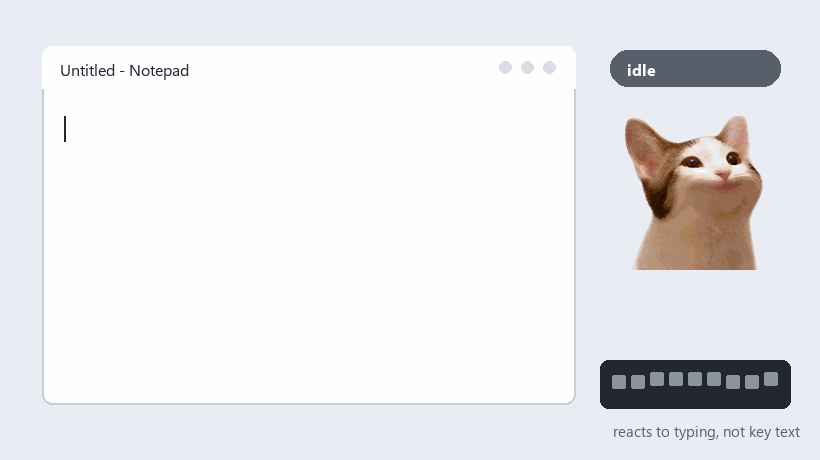

# Cheerie

Cheerie is the English nickname for **응원이**, a tiny Windows desktop pet that cheers you on while you type.

Type a little and Cheerie opens its mouth to cheer for you. Keep typing and the cheering ramps up: a few yellow stars first, then a red, full-power cheer when you really get going. It is a small meme app for receiving over-the-top support while you work, made with beginner-friendly Python, Tkinter, PyInstaller, and a little vibe coding energy.



## Features

- Reacts to global keyboard and mouse activity
- Idle, gentle cheer, and full-power cheer animations
- Keeps sending hearts while the mouse is hovering over Cheerie or while you hold-click it
- Multiple reminder alarms
- Custom message text for each alarm popup
- English/Korean UI setting
- Flip horizontal/vertical from the right-click menu
- Stores settings in Windows Registry, so the exe can be used without a separate JSON file
- PyInstaller build script for creating a standalone exe

## Run From Source

```powershell
python -m venv .venv
.\.venv\Scripts\activate
pip install -r requirements.txt
python cheerie.py
```

## Build Exe

```powershell
.\build_public.bat
```

The output will be created at:

```text
dist\Cheerie.exe
```

For a ready-made Windows build, check the GitHub Releases page.

## Privacy

Cheerie reacts to input events, not key contents. It does not save typed text. Settings are stored at:

```text
HKEY_CURRENT_USER\Software\Cheerie
```

## Suggested GitHub Topics

`python`, `tkinter`, `windows`, `desktop-pet`, `keyboard`, `pynput`, `pyinstaller`, `reminder`, `vibe-coding`, `beginner-friendly`, `cat`

## 한국어

Cheerie는 **응원이**의 영어 이름입니다. 키보드와 마우스 입력량에 반응하는 작은 Windows 데스크탑 고양이예요. 조금 타이핑하면 입을 벌려 응원해주고, 계속 두드리면 노란 별을 띄우다가 빨갛게 달아올라 더 격렬하게 응원해줍니다. 작업 중에 바탕화면에서 과하게 응원받는 가벼운 밈 앱입니다.

- 우클릭 메뉴에서 설정, 반전, 알람 테스트, 종료 가능
- 알람 여러 개 추가 가능
- 알람마다 표시할 문구 설정 가능
- 설정에서 English/한국어 선택 가능
- 입력된 키 내용은 저장하지 않고 입력 이벤트에만 반응합니다
